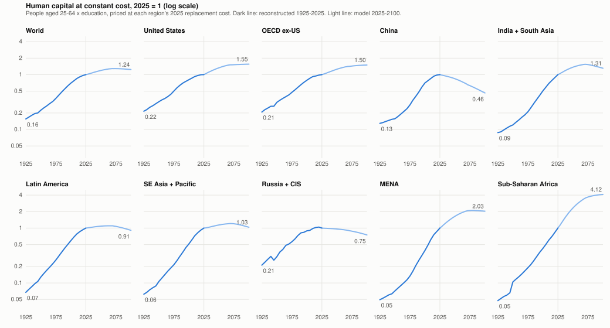

# Are We Building Up or Drawing Down Human Capital?

*Research note, September 2026. Projections generated with
`npm run human-capital:trajectory` (default parameters; scenario and sensitivity
runs noted where used); the 1925-2025 reconstruction with
`scripts/human-capital-backcast.py`.*

## Question

Treat people times education as a capital asset: capitalize what it costs to
rear and school each workforce entrant, and depreciate that cost over the
years the entrant is expected to spend in the workforce. Then ask, region by
region and year by year, whether the stock is growing or shrinking, and
whether the world (and the United States in particular) is spending more or
less on it than before.

The ledger is the `humanCapital` module documented in `docs/HUMAN_CAPITAL.md`:
a Kendrick-style cost-based account at current replacement cost, four
education bands, straight-line depreciation over an expected working life
that nets out death, disability, domestic-role, and retirement exits. It is
diagnostic: it reads demographics and GDP and feeds nothing back.

## One accounting point first

The ledger prices every entrant as a multiple of the region's current GDP per
capita: rearing at the USDA out-of-pocket share (23% of GDP per capita a
year through the band's entry age) plus OECD spending per student for each
schooling stage. This is the explicit-outlay scope; students' foregone
earnings are out of it by default (an earlier draft of this note priced
them at 45% of GDP per capita a year and rearing at 30%, which raised every
dollar figure by about 40% and moved the world's net-investment turn from
2025 to the mid-2040s without changing a single peak year or regional
ordering).

Because unit costs track income, the dollar stock rises with GDP per
capita even when the workforce it prices is shrinking. On the default path
the world net stock goes from $233T in 2025 to $3,020T in 2100, a 13-fold
rise that is almost entirely revaluation. To answer "growing or shrinking"
the note deflates each region's stock by that region's own GDP-per-capita
index (2025 = 1). The result is a constant-cost quantity: how many
2025-dollars of rearing and schooling are embodied in the people at work,
at 2025 prices.

## World

| Year | Investment $T | Depreciation + write-offs $T | Net $T | Investment / GDP | Constant-cost net stock (2025 = 1) | Entrants (M) | Tertiary+ share of workforce |
|------|------|------|------|------|------|------|------|
| 2025 | 15.2 | 15.2 | -0.0 | 9.6% | 1.00 | 119.2 | 24% |
| 2030 | 17.1 | 16.8 | +0.3 | 9.7% | 1.04 | 119.6 | 27% |
| 2040 | 22.8 | 22.8 | 0.0 | 9.6% | 1.13 | 118.8 | 37% |
| 2050 | 31.2 | 32.7 | -1.6 | 9.2% | 1.19 | 116.3 | 45% |
| 2060 | 41.8 | 46.1 | -4.3 | 8.9% | 1.22 | 112.8 | 52% |
| 2075 | 62.3 | 72.4 | -10.0 | 8.4% | 1.20 | 106.7 | 59% |
| 2100 | 149.9 | 176.8 | -26.9 | 7.9% | 1.14 | 95.7 | 59% |

Three things stand out.

1. **The world is at break-even now, and the build is ending.** At current
   cost the ledger capitalizes exactly what it charges in 2025 and hovers
   within half a trillion dollars of zero until 2040, then runs a growing
   net disinvestment. In constant-cost terms the stock still grows, about
   0.9% a year through the early 2030s and half that by the 2040s, because
   the revaluation of the opening stock is not a charge; it peaks in 2063
   at 22% above 2025 and drifts down about 0.2% a year to end 14% above.
2. **What is being built is education, not headcount.** Entrants fall from
   119M to 96M a year, but the tertiary-plus share of the in-service
   workforce goes from a quarter to three-fifths, and a tertiary entrant
   carries about twice the cost of a secondary one in the world average
   ($204k against $98k in 2025), because tertiary entrants are
   concentrated in richer regions. Nearly all of the
   quantity growth to 2060 is composition; from the 2080s the tertiary
   headcount is itself falling.
3. **The spending share slips, not collapses.** Investment runs 9.6% of
   GDP now and 7.9% in 2100, because entrant cohorts shrink relative to GDP
   while per-entrant cost tracks income. Spending per entrant rises
   throughout; spending on entrants as a whole loses under two points of
   GDP over the century.

## By region

Constant-cost net stock index (2025 = 1), the peak year of that index, the
first year own-cohort net investment is negative, the same including
migration transfers, and the change in annual entrants over the century.

| Region | 2030 | 2050 | 2075 | 2100 | Peak | Peak level | Net < 0 | Net + migration < 0 | Entrants 2100 / 2025 |
|--------|------|------|------|------|------|------|------|------|------|
| United States | 1.09 | 1.33 | 1.41 | 1.43 | 2100 | 1.43 | 2032 | 2065 | 0.95 |
| OECD ex-US | 1.04 | 1.23 | 1.35 | 1.39 | 2100 | 1.39 | 2025 | 2086 | 1.11 |
| China | 0.93 | 0.72 | 0.54 | 0.39 | 2025 | 1.00 | 2025 | 2025 | 0.36 |
| India + South Asia | 1.14 | 1.53 | 1.43 | 1.20 | 2056 | 1.56 | 2061 | 2056 | 0.56 |
| Latin America | 1.02 | 1.10 | 1.01 | 0.84 | 2053 | 1.11 | 2068 | 2051 | 0.56 |
| SE Asia + Pacific | 1.03 | 1.19 | 1.14 | 0.94 | 2058 | 1.21 | 2072 | 2058 | 0.61 |
| Russia + CIS | 0.97 | 0.92 | 0.82 | 0.68 | 2025 | 1.00 | 2025 | 2025 | 0.59 |
| MENA | 1.22 | 1.89 | 2.00 | 1.89 | 2065 | 2.01 | 2056 | 2063 | 0.84 |
| Sub-Saharan Africa | 1.37 | 2.82 | 3.64 | 3.89 | 2100 | 3.89 | never | never | 1.26 |
| World | 1.04 | 1.19 | 1.20 | 1.14 | 2063 | 1.22 | 2025 | | 0.80 |

The regions fall into four groups.

- **Drawing down from today: China, Russia + CIS.** China charges more
  depreciation than it capitalizes in every year of the run. Its entrant
  cohort falls by nearly two-thirds and its constant-cost stock by 61% by
  2100, even though the rising college share means each entrant embodies
  more. In current dollars the Chinese stock still rises about 11-fold,
  which is the revaluation trap: a shrinking, better-educated workforce
  repriced at higher income looks like accumulation. Russia + CIS follows
  the same shape at a gentler slope.
- **Building to the 2050s, then drawing down: India + South Asia, Latin
  America, SE Asia + Pacific, MENA.** These are the demographic-dividend
  regions. India peaks in 2056 at 1.56 times its 2025 stock and gives back
  most of the gain by 2100. MENA doubles and holds. India, Latin America,
  and SE Asia are net exporters of trained people, and the outflow brings
  their turning points forward by 5 to 17 years; MENA is a small net
  receiver and its turn comes later once migration is counted.
- **Building throughout: Sub-Saharan Africa.** The only region whose
  entrant cohort is larger in 2100 than in 2025, and the only one whose
  own-cohort net investment never turns negative. Its stock nearly
  quadruples, from a base that is 3% of the world total.
- **Building only through immigration: United States, OECD ex-US.** Both
  rich-region stocks rise through 2100, but own-cohort net investment is
  negative from 2025 in the OECD ex-US and from 2032 in the US. What keeps
  the stocks growing is the migration transfer: working-age arrivals booked
  at the destination's replacement cost. That transfer covers the own-cohort
  deficit until the mid-2060s (US) and the mid-2080s (OECD ex-US).

## The United States

| Year | Entrants (M) | Investment $T | Charge $T | Own-cohort net $T | Migration transfer $T | Net incl. migration $T | Investment / GDP |
|------|------|------|------|------|------|------|------|
| 2025 | 4.1 | 2.72 | 2.54 | +0.18 | 0.63 | +0.81 | 11.4% |
| 2035 | 4.0 | 3.17 | 3.28 | -0.11 | 0.78 | +0.67 | 10.7% |
| 2050 | 4.0 | 4.71 | 5.53 | -0.82 | 1.24 | +0.41 | 10.0% |
| 2075 | 3.9 | 8.89 | 11.31 | -2.42 | 2.37 | -0.05 | 9.3% |
| 2100 | 3.9 | 22.47 | 28.69 | -6.21 | 5.82 | -0.40 | 8.8% |

The US invests a larger share of GDP than any region in 2025 except MENA
and Sub-Saharan Africa, because its entrants are expensive (a 42%
college share and the world's highest GDP per capita) rather than
numerous. Its entrant cohort is flat at about 4.0M a year for the whole
century, held up by a 1.4 fertility floor and net immigration of about 1.2M
a year (UN WPP 2024 and CBO 2025 assumptions in `demographics.ts`). The
own-cohort account turns negative in 2032, when the large cohorts now in
mid-career start to retire faster than the flat entrant flow replaces them.
Immigration is worth about a fifth of gross additions throughout, and it is
what keeps the US stock growing. With migration switched off everywhere
(`--set=demographics.migrationMultiplier=0`, which also removes migrants'
children from future cohorts), US entrants fall by a third instead of 5%,
the US constant-cost stock peaks in 2046 at 1.07 and ends the century at
0.88, and the OECD ex-US stock declines from 2025 to 0.76 by 2100. The US
result is therefore an immigration-policy result at least as much as a
demographic one.

## The prior 100 years

The simulation starts in 2025 and cannot run backwards, so the century before
it is reconstructed from observed data and priced with the same ledger. The
stock is people aged 25-64 times their education (Lee and Lee's long-run
attainment series, 1870-2040, and Barro-Lee by age group), valued at the
ledger's replacement-cost multipliers; entrants are the population aged 20-24
divided by five, with the attainment mix of the cohort five years on. Costs
are multiples of GDP per capita (Maddison), so investment and stock relative
to GDP depend only on demographics and education, and the constant-cost stock
holds each region's 2025 unit cost fixed. Countries are grouped into the
model's nine regions so that the 2025 totals match the model's population
anchors within a few percent (Sub-Saharan Africa is the exception, at 12%
below). Lee-Lee and Barro-Lee count China's completed tertiary attainment at
about 3% of ages 25-64 in 2015, far below the census, so China's tertiary
shares from 2000 on are overridden with the NBS census communiqués (junior
college and above, rescaled to ages 25-64) and the Ministry of Education's
gross tertiary enrollment ratio for entrants, ending at the model's own 2025
anchor. Before 1950 the level follows each region's total population from
the 1950 age structure, with Lee-Lee supplying the education mix and the
change in age shares, because its pre-1950 country series sit on older
territories (British India, the USSR). The headline series is gross (no
age-based write-down) so that it can reach back to 1925; a net series from
the age structure is given below from 1950. Method and sources are in the
script header.

| Year | Population 25-64 (M) | Entrants (M/yr) | Tertiary share of 25-64 | Entrants / population | Investment / GDP | Gross stock / GDP | Constant-cost stock (2025 = 1) |
|---|---|---|---|---|---|---|---|
| 1925 | 816 | 37 | 1% | 1.9% | 9.3% | 2.2 | 0.18 |
| 1950 | 1,042 | 44 | 1% | 1.8% | 9.5% | 2.4 | 0.24 |
| 1975 | 1,575 | 72 | 3% | 1.8% | 11.1% | 2.6 | 0.39 |
| 2000 | 2,778 | 104 | 9% | 1.7% | 10.7% | 3.3 | 0.71 |
| 2010 | 3,342 | 124 | 12% | 1.8% | 11.5% | 3.5 | 0.86 |
| 2025 | 4,083 | 125 | 13% | 1.5% | 10.3% | 3.7 | 1.00 |

The world's stock of pre-workforce human capital grew between five- and
sixfold over the century, 1.7% a year: 1.6 points of that is more people
of working age and 0.1 points is more education per person. Growth
accelerated through each quarter-century, from 1.3% a year in 1925-1950 to
a peak of 2.4% in 1975-2000, then slowed to 1.4% in 2000-2025 and 0.8% in
the last decade. The model's 0.9% for the late 2020s, falling to zero by
the 2060s, is the continuation of that deceleration, not a break from it.

Constant-cost stock index (2025 = 1), reconstruction to 2025 and model after
(gross, so the model column is the gross stock deflated the same way):

| Region | 1925 | 1950 | 1975 | 2000 | 2025 | 2050 | 2075 | 2100 | 1925-2025 (%/yr) | 2025-2100 (%/yr) |
|---|---|---|---|---|---|---|---|---|---|---|
| United States | 0.23 | 0.34 | 0.51 | 0.81 | 1.00 | 1.30 | 1.46 | 1.50 | +1.5 | +0.5 |
| OECD ex-US | 0.31 | 0.42 | 0.60 | 0.90 | 1.00 | 1.22 | 1.38 | 1.44 | +1.2 | +0.5 |
| China | 0.12 | 0.15 | 0.27 | 0.68 | 1.00 | 0.81 | 0.59 | 0.43 | +2.1 | -1.1 |
| India + South Asia | 0.10 | 0.12 | 0.21 | 0.51 | 1.00 | 1.31 | 1.44 | 1.23 | +2.3 | +0.3 |
| Latin America | 0.07 | 0.12 | 0.25 | 0.57 | 1.00 | 1.05 | 1.02 | 0.86 | +2.7 | -0.2 |
| SE Asia + Pacific | 0.07 | 0.11 | 0.22 | 0.53 | 1.00 | 1.10 | 1.13 | 0.97 | +2.7 | -0.0 |
| Russia + CIS | 0.24 | 0.33 | 0.59 | 0.90 | 1.00 | 0.94 | 0.84 | 0.72 | +1.4 | -0.4 |
| MENA | 0.06 | 0.08 | 0.15 | 0.42 | 1.00 | 1.58 | 1.99 | 1.94 | +2.9 | +0.9 |
| Sub-Saharan Africa | 0.07 | 0.10 | 0.19 | 0.43 | 1.00 | 2.22 | 3.45 | 3.84 | +2.7 | +1.8 |
| World | 0.18 | 0.24 | 0.39 | 0.71 | 1.00 | 1.16 | 1.23 | 1.18 | +1.7 | +0.2 |

Every region but one built human capital in every quarter-century of the
last hundred years; the exception is Russia + CIS, whose series falls in
1940-1945 and again after 2020. The century ahead is the first in which
any region draws down by choice of fertility rather than by catastrophe.
China's reversal is the sharpest in the table: from the fastest builder of
1975-2000 (3.7% a year), and still 1.5% a year in 2000-2025, to a 1.1% a
year decline. Russia + CIS has already stalled, with its 2025 stock below
2015, and the OECD ex-US has been flat for a decade. The regions that grew
fastest in the past century (MENA, Latin America, SE Asia, Sub-Saharan
Africa, all between 2.7% and 2.9% a year) are the ones with the most
building left, and only Sub-Saharan Africa keeps anything like its
historical pace.

The same splice on a net basis, with each age group written down
straight-line over its band's expected working life (Barro-Lee's 10-year
age groups from 1950, cohort-shifted after 2015), tracks the model's own
net stock:

| Region | 1950 | 1975 | 2000 | 2025 | 2050 | 2075 | 2100 | Net / gross 1950 | Net / gross 2025 |
|---|---|---|---|---|---|---|---|---|---|
| United States | 0.31 | 0.51 | 0.84 | 1.00 | 1.33 | 1.41 | 1.43 | 0.36 | 0.39 |
| OECD ex-US | 0.34 | 0.59 | 0.98 | 1.00 | 1.23 | 1.35 | 1.39 | 0.27 | 0.33 |
| China | 0.11 | 0.25 | 0.75 | 1.00 | 0.72 | 0.54 | 0.39 | 0.26 | 0.35 |
| India + South Asia | 0.09 | 0.16 | 0.48 | 1.00 | 1.53 | 1.43 | 1.20 | 0.28 | 0.38 |
| Latin America | 0.10 | 0.22 | 0.60 | 1.00 | 1.10 | 1.01 | 0.84 | 0.30 | 0.36 |
| SE Asia + Pacific | 0.09 | 0.20 | 0.53 | 1.00 | 1.19 | 1.14 | 0.94 | 0.30 | 0.35 |
| Russia + CIS | 0.25 | 0.53 | 0.92 | 1.00 | 0.92 | 0.82 | 0.68 | 0.30 | 0.38 |
| MENA | 0.05 | 0.12 | 0.41 | 1.00 | 1.89 | 2.00 | 1.89 | 0.27 | 0.39 |
| Sub-Saharan Africa | 0.08 | 0.15 | 0.40 | 1.00 | 2.82 | 3.64 | 3.89 | 0.28 | 0.38 |
| World | 0.20 | 0.36 | 0.75 | 1.00 | 1.19 | 1.20 | 1.14 | 0.30 | 0.36 |

The net stock grew faster than the gross one (2.2% a year for the world
since 1950 against 1.9%), because the book value of the workforce rose
from 30% to 36% of replacement cost as it filled with recent,
better-educated entrants; the OECD ex-US has been flat on a net basis
since 2000 and Russia + CIS nearly so. The model's net stock in 2025 is
44% of gross, above the reconstruction's 36%, because it prices the
in-service workforce rather than everyone aged 25-64. The two series agree
on direction and turning points, so the splice does not depend on the
gross/net choice.

## Are we spending more or less than we used to?

Investment in new entrants as a share of GDP, reconstructed:

| Region | 1925 | 1950 | 1975 | 2000 | 2010 | 2025 |
|---|---|---|---|---|---|---|
| United States | 10.7% | 10.4% | 13.6% | 10.9% | 11.7% | 11.0% |
| OECD ex-US | 9.8% | 9.4% | 10.4% | 9.8% | 9.2% | 8.3% |
| China | 6.8% | 8.6% | 12.1% | 10.5% | 13.6% | 9.4% |
| India + South Asia | 6.1% | 7.5% | 8.7% | 11.1% | 12.0% | 12.5% |
| Latin America | 8.3% | 8.6% | 10.1% | 11.8% | 12.0% | 11.5% |
| SE Asia + Pacific | 7.7% | 8.3% | 9.3% | 11.6% | 11.9% | 11.6% |
| Russia + CIS | 14.6% | 13.8% | 12.8% | 12.5% | 14.7% | 9.4% |
| MENA | 7.2% | 7.2% | 8.7% | 11.9% | 13.0% | 12.0% |
| Sub-Saharan Africa | 7.4% | 7.6% | 8.2% | 9.8% | 10.3% | 12.1% |
| World | 9.3% | 9.5% | 11.1% | 10.7% | 11.5% | 10.3% |

The world spends slightly more of its output on new human capital than it
did a century ago, and less than it did fifteen years ago. The share rose
from about 9% of GDP in 1925 to a peak near 11.5% in 2010 as the education
mix upgraded faster than cohorts shrank, and has since fallen back to
about 10% as the youth share of population dropped from 1.8% to 1.5%. Per
entrant, the world spends 1.6 times its 1925 multiple of GDP per capita on
rearing and schooling (4.4 to 7.2 times GDP per capita), and GDP per
capita is itself far higher. The model's 9.6% for 2025 sits within a
point of the reconstruction, and its slow decline to 8% by 2100 continues
the post-2010 slide.

The United States:

| Year | Entrants (M/yr) | Entrants / population | Entrant tertiary share | Workforce 25-64 (M) | Tertiary share of 25-64 | Investment / GDP | Constant-cost stock (2025 = 1) |
|---|---|---|---|---|---|---|---|
| 1925 | 1.90 | 1.70% | 8% | 53 | 5% | 10.7% | 0.23 |
| 1940 | 2.17 | 1.67% | 10% | 65 | 6% | 11.2% | 0.28 |
| 1950 | 2.35 | 1.53% | 13% | 77 | 8% | 10.4% | 0.34 |
| 1960 | 2.22 | 1.23% | 16% | 84 | 10% | 8.8% | 0.39 |
| 1970 | 3.47 | 1.67% | 25% | 92 | 14% | 12.7% | 0.45 |
| 1980 | 4.35 | 1.89% | 32% | 110 | 22% | 14.8% | 0.58 |
| 1990 | 3.86 | 1.52% | 33% | 131 | 28% | 12.1% | 0.71 |
| 2000 | 3.89 | 1.38% | 33% | 148 | 29% | 10.9% | 0.81 |
| 2010 | 4.46 | 1.44% | 41% | 166 | 33% | 11.7% | 0.93 |
| 2020 | 4.45 | 1.31% | 40% | 178 | 33% | 10.7% | 1.00 |
| 2025 | 4.61 | 1.34% | 40% | 178 | 33% | 11.0% | 1.00 |

The US series has one large hump: the baby boom entering the workforce
with the first mass college cohorts, which took investment from under 9%
of GDP in 1960 to nearly 15% in 1980. Since then the share has drifted
between 11% and 12%, more education per entrant offsetting a falling youth
share. The stock grew 1.5% a year over the century (1.2 points people, 0.3
education), but only 0.3% a year in the last decade, and the 25-64
population has been flat since 2020. The reconstruction reaches 2025 with
the US stock already at a plateau; the model's 0.9% a year growth to 2050
therefore rests on its immigration assumption and on entrants' college
share continuing to rise, as the previous section shows.

Outside data say the same. Total US education spending has held at about
5.4 to 5.6% of GDP in recent years, having peaked at 6.7% in 2009 (World
Bank/UIS series), while the US birth cohort fell from 4.32M in 2007 to 3.63M
in 2024 (NCHS). World government education spending was 4.16% of GDP in
2019 and 3.51% in 2023 (World Bank, from UNESCO UIS). The ledger's 10% is
not comparable to those 4 to 6% education shares: it also counts rearing to
entry age. With rearing excluded the model's 2025 flow is 4.1% of GDP,
close to the world education share.

## Robustness

- **Energy and climate scenarios do not move the quantity path.** `ssp3-70`
  and `net-zero` produce identical constant-cost stocks, entrant flows, and
  regional peak years to the default run; only the dollar values differ,
  because those scenario files leave demographics untouched. The
  human-capital trajectory in this model is a demographic and education
  result, not an energy one.
- **Cost scope shifts levels and the world turning point, not the regional
  ordering.** Adding students' foregone earnings at the Kendrick/BEA share
  (`foregoneEarningsShare` 0.45) raises the 2025 flow to 11.9% of GDP and
  keeps the world's net investment positive until 2046, because the
  opportunity cost weights the young, tertiary-heavy cohorts; pricing
  rearing at the National Transfer Accounts midpoint (0.30) gives 11.3%
  and leaves the turn at 2025; removing rearing gives 4.1% and a turn in
  2047. Peak years move by at most two years in every case, and the four
  regional groups are unchanged.

## Reconciliation with the G7-BRIC spreadsheet

The G7-BRIC human-capital model (v4, 4 September 2026) is a single-year
2025 account for eleven countries in billions of 2024 PPP dollars, with five
or six education bands per country. It capitalizes paid care and schooling
only (no student opportunity cost, no unpaid care), applies participation
at entry, amortizes straight-line over effective exit age minus entry age
(41-45 years in the G7, 32-42 in the BRICs) with WHO age-specific mortality
and no other pre-retirement exits, and values migrants at remaining book
value at age 32 with the domestic education mix. The ledger's default cost
scope now matches it (its US care cost through 18 is 23% of GDP per
capita, the USDA figure the ledger uses). The two models agree on every
sign and on the ordering of countries; what remains between them is the
participation filter, the treatment of working life, and migration.

2025 flows in $T at current cost, and the end-2025 net stock. Model regions
are wider than the spreadsheet's countries: India + South Asia, Russia +
CIS, and OECD ex-US (all Europe, Japan, Korea, Canada, Australia, New
Zealand, Israel) against India, Russia, and the six non-US G7 members.

| | Entrants (M) | Investment | Depreciation + write-offs | Own-cohort net | Migration | Net incl. migration | Net stock |
|---|---|---|---|---|---|---|---|
| **United States**: spreadsheet | 3.64 | 2.41 | 2.42 | -0.01 | +0.36 | +0.35 | 55.7 |
| model, default | 4.08 | 2.72 | 2.54 | +0.18 | +0.63 | +0.81 | 42.9 |
| model, life = exit minus entry | 4.08 | 2.72 | 2.54 | +0.18 | +0.65 | +0.83 | 55.0 |
| **China**: spreadsheet | 11.97 | 1.80 | 1.90 | -0.10 | -0.01 | -0.11 | 38.0 |
| model, default | 11.99 | 2.34 | 3.32 | -0.98 | -0.04 | -1.01 | 54.2 |
| model, life = exit minus entry | 11.99 | 2.34 | 3.34 | -1.00 | -0.04 | -1.04 | 72.1 |
| **India**: spreadsheet | 17.0 | 0.87 | 0.70 | +0.17 | -0.01 | +0.16 | 13.6 |
| model (India + South Asia), default | 31.5 | 1.78 | 1.35 | +0.43 | -0.09 | +0.35 | 14.8 |
| model, life = exit minus entry | 31.5 | 1.78 | 1.34 | +0.44 | -0.09 | +0.35 | 29.5 |
| **Russia**: spreadsheet | 1.31 | 0.30 | 0.42 | -0.12 | -0.02 | -0.14 | 7.5 |
| model (Russia + CIS), default | 3.19 | 0.68 | 0.74 | -0.06 | -0.04 | -0.10 | 12.1 |
| model, life = exit minus entry | 3.19 | 0.68 | 0.74 | -0.06 | -0.04 | -0.10 | 16.1 |
| **G7 ex-US**: spreadsheet (six countries) | 3.96 | 1.69 | 2.08 | -0.39 | +0.19 | -0.20 | 44.2 |
| model (OECD ex-US), default | 7.20 | 3.08 | 3.80 | -0.71 | +1.10 | +0.39 | 61.5 |
| model, life = exit minus entry | 7.20 | 3.08 | 3.80 | -0.72 | +1.15 | +0.43 | 82.1 |

"Life = exit minus entry" is the model rerun with the exit hazards switched
off, so that useful life is retirement age minus entry age and there are
no write-offs, as in the spreadsheet.

**The US bridge.** The model's $2.72T of 2025 investment becomes the
spreadsheet's $2.41T in one step: the spreadsheet applies participation at
entry (3.64M effective entrants against the model's 4.08M), which the
model handles instead through exit hazards and write-offs over the career.
Depreciation matches at $2.5T against $2.4T. The net stock matches at $55T
once working life is defined the same way; on the model's own shorter
expected working lives the US stock is $43T. Both accounts put the US at
break-even on its own children in 2025 (+$0.18T against -$0.01T) and
positive only because of immigration.

**Where the models agree.** China, Russia and the non-US G7 are net
disinvestors on their own cohorts in both; India is a net investor in both;
the US is at zero. The China entrant count is identical (12.0M), because
both take the cohort turning 20 from the same UN age structure, and the
spreadsheet's entrant tertiary share for China (55%) is close to the
model's 61%, both far above the Lee-Lee figure the reconstruction had to
override.

**Where they differ, and why.**

1. *Care cost outside the US.* The spreadsheet scales care by household
   consumption relative to the US rather than by GDP per capita, which
   roughly halves it for China (China's consumption share of GDP is about
   38% against the US's 68%); this is most of the gap in China's investment
   ($1.8T against $2.3T) and stock ($38T against $54T).
2. *Useful life and exits.* The spreadsheet amortizes over 41-45 years and
   charges only mortality. The model's expected working lives are 28-39
   years because they net out disability and domestic-role exits, which it
   writes off at book value. That is why the model's charge exceeds the
   spreadsheet's by more than its investment does, and why its own-cohort
   net is more negative for China (-$1.0T against -$0.1T). The spreadsheet's
   note that net "still excludes unestimated disability and unscheduled
   retirement" and its break-even sensitivity (a 0.16% annual non-fatal
   loss would erase the G7's net) point at the same mechanism from the
   other side.
3. *Migration.* This is the one substantive disagreement. The spreadsheet's
   G7 ex-US is a net disinvestor even after migration (-$0.20T); the
   model's OECD ex-US turns positive (+$0.39T). Two assumptions drive it.
   The model's demographics move 3.4M net working-age migrants a year into
   the OECD ex-US and 1.27M into the US, against the spreadsheet's 1.1M
   and 0.73M effective (1.3M times a 70% working-age share and 80%
   participation). And the model books migrants with a 70% college share
   at the destination's full replacement cost, about $500k each for the
   US, against the spreadsheet's domestic mix at remaining value at age
   32, about $500k on its lower unit costs but for far fewer people.
   Together they make the model's migration transfer 1.8 times the
   spreadsheet's for the US and 6 times for the OECD ex-US. The
   spreadsheet's treatment is the more conservative and the better
   documented; the model's college-share and full-cost assumptions are the
   two places in this note where the reader should discount.
4. *Scope of the regions.* The model's India + South Asia has 1.9 times
   the spreadsheet's Indian entrants, and Russia + CIS 2.4 times Russia's,
   because Pakistan, Bangladesh and Central Asia are young; the regional
   Russia net is near zero where the spreadsheet's Russia is clearly
   negative. The spreadsheet's country figures are the better read of
   Russia itself.

None of the note's conclusions turn on the level. The peak years, the
regional ordering, and the US dependence on immigration come from
demographics and the education mix, which the two models share. What the
spreadsheet changes is the size of the immigration offset for the rich
regions: on its conventions, the US stays marginally positive and the rest
of the G7 does not.

## What the result does not say

- Cost is not value. A lifetime-income (Jorgenson-Fraumeni) account would be
  several times larger and would respond to wage premia this ledger ignores.
- Post-entry training, learning on the job, and obsolescence are outside the
  ledger; a shrinking pre-workforce stock is compatible with rising skill if
  on-the-job investment grows.
- Immigrants are booked at the destination's full replacement cost with no
  under-employment discount and a 70% college share, so the rich-region
  migration transfers are an upper bound; the reconciliation above sizes
  the difference.
- The reconstruction prices everyone aged 25-64, not the in-service
  workforce: the model nets out domestic-role and disability exits, the
  reconstruction cannot, because participation by age and education is not
  observed before the 1990s. That is a level difference (the net/gross
  ratios above), and where participation rose over the century, as women's
  did in the OECD after 1950, the in-service stock grew faster than the
  series shows. Migration is inside the population counts, so the stock is
  complete, but the flows are not split between births and arrivals.
- China's tertiary shares are census and enrollment based from 2000 on
  (see the method note), a correction to the source rather than an
  observation of attainment by age; the Barro-Lee age profile is scaled to
  the census total. Before 1950 the covered countries are scaled to regional
  population totals, which assumes uncovered countries had the covered
  average attainment; Russia + CIS and India before 1950 rest on Lee-Lee's
  Soviet-era and British-India series, used only as ratios, and should be
  read as rough.
- Demographics follow the UN WPP 2024 low variant, so entrant cohorts
  outside Sub-Saharan Africa shrink faster than a medium-variant path would
  give; the medium variant would delay every peak year but not remove the
  ordering.

## Sources

- World Bank, *Government expenditure on education, total (% of GDP)*
  (SE.XPD.TOTL.GD.ZS), from UNESCO Institute for Statistics: world 4.16%
  (2019), 3.51% (2023); United States series and the 2009 peak.
- NCHS, *Births in the United States, 2024* (Data Brief 535) and *National
  Vital Statistics Reports* 74(1): 4,316,233 births in 2007, 3,628,934 in
  2024, total fertility rate 1.63.
- USDA (2017). *Expenditures on Children by Families, 2015*: $233,610
  through age 17 for a middle-income married-couple family, the 23% of GDP
  per capita rearing share.
- Lee, J.-W. and Lee, H. (2016). "Human Capital in the Long Run." *Journal
  of Development Economics* 122: attainment by level for ages 15-24 and
  25-64, 1870-2010, with projections to 2040 (OUP long-run files); Barro, R.
  and Lee, J.-W. (2013), v3 dataset by 10-year age group, 1950-2015.
- National Bureau of Statistics of China, *Communiqués of the Fifth, Sixth
  and Seventh National Population Censuses* (2000, 2010, 2020): persons with
  junior college and above per 100,000 (3,611; 8,930; 15,467); Ministry of
  Education statistical bulletins, gross tertiary enrollment ratio
  (1990-2023).
- UN DESA, *World Population Prospects 2024*, population by 5-year age
  group, medium variant; Maddison Project Database 2023 (GDP per capita,
  2011$) and Our World in Data population series (Gapminder/HYDE/UN).
- *G7-BRIC human-capital model v4* (Google Sheets, 4 September 2026):
  2025 flows for the G7 and BRICs from World Bank cohorts, OECD Education
  and Pensions at a Glance, WHO life tables, and national migration
  statistics.
- `docs/HUMAN_CAPITAL.md` for the ledger's method, calibration, and prior
  art (Kendrick 1976; Eisner 1985; Mallatt 2026; Eurostat duration of
  working life).
