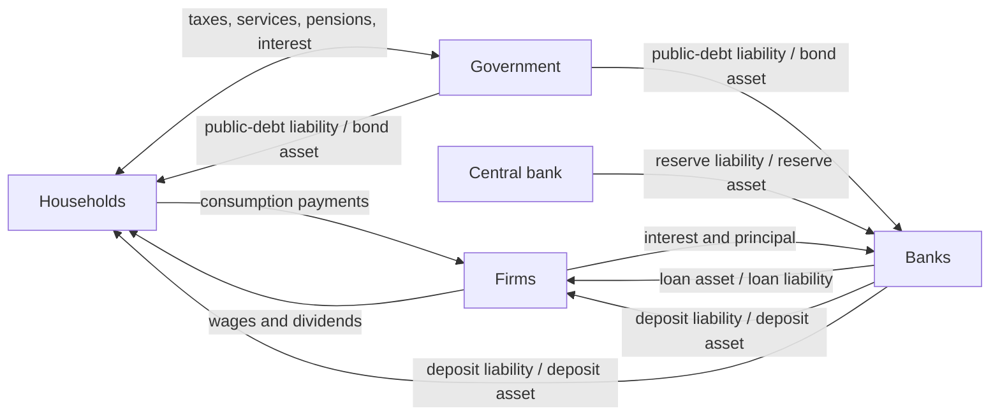

# What this repository should learn from Steve Keen and Minsky

Date: 2026-07-27

## Bottom line

The useful lesson is not “adopt every Keen claim” and it is not “rewrite the
repository in Minsky.” It is to make every financial claim have a counterparty,
make nonlinear dynamics inspectable away from equilibrium, and treat energy as
a production constraint worth testing rather than assuming away.

That has now been implemented in four separable layers:

1. A reusable, domain-independent Godley ledger in
   `packages/tsimulation/src/godley.ts`.
2. Finite-difference Jacobian, eigenvalue, timestep-convergence, and debt-basin
   diagnostics in `packages/tsimulation/src/dynamics.ts` and
   `src/diagnostics/financial-stability.ts`.
3. A Keen–Ayres–Standish energy-essential challenger beside the calibrated
   Ayres–Warr production function in `src/modules/production.ts`.
4. A profit-led monetary circuit in `src/modules/capital.ts`: investment
   orders precede finance, bank lending creates deposits for the financing
   gap, and household saving is measured afterward rather than treated as a
   second pot of investable money.

Minsky remains useful as a visual authoring and teaching environment. Its
official description emphasizes a flowchart canvas, an ODE solver, dynamic
plots, and Godley tables; the project was updated on 2026-06-23. Its manual
requires financial rows to satisfy `Assets - Liabilities - Equity = 0`.
[Minsky project](https://sourceforge.net/projects/minsky/),
[Godley-table manual](https://minsky.sourceforge.io/manual/minsky/node130.html)

## What changed after the first model pass

| Question | Earlier behavior | Current revision | Why the revision is better |
| --- | --- | --- | --- |
| What was `creditImpulse`? | Called “net” but calculated as gross new lending | Separates refinanced principal, net-new investment credit, total originations, repayments, write-offs, and net credit creation | Refinancing no longer masquerades as new purchasing power or new cohort debt |
| What funded investment? | Added a behavioral saving flow to gross loan originations, double-counting saving and deposit-creating credit as independent pots | Profit-responsive firm orders are funded by internal firm cash flow plus net cash credit; household saving is computed ex post | The causal direction matches the monetary circuit and the accounting identity `S = I` is a result rather than a loanable-funds assumption |
| Who held the debt? | No modeled bank or bondholder counterparty | Firms, banks, households, government, and the central bank carry matched claims | Defaults now reduce bank equity rather than vanishing |
| What counted as GDP? | Pensions, healthcare, education, and public interest were all added as if final output; a 20% consumption floor could break the identity | `GDP = household consumption + investment + government services`; pensions and interest are transfers | This matches the expenditure concept of final goods and services rather than double-counting redistribution |
| How was debt integrated? | One annual Euler step | Quarterly by default, compared with annual and monthly solutions | Quarterly private debt is 0.025% from the monthly result versus 0.147% for annual in the baseline point |
| Could output exist without energy? | A 1% energy-ratio floor left positive output at zero useful energy | Both production equations return zero at zero useful energy | Removes a physically impossible hidden floor |
| Was the energy equation contestable? | Only the Ayres–Warr equation drove and reported GDP | Reports Ayres–Warr and Keen estimates together; a weight selects either equation | Structural disagreement is visible instead of buried in prose |

The GDP correction is conventional national accounting, not a heterodox
victory: BEA defines expenditure GDP from final consumption, investment,
government consumption/investment, and net exports. Financial-claim exchanges
are not current production. [BEA expenditure approach](https://www.bea.gov/help/glossary/expenditures-approach),
[BEA treatment of financial claims](https://www.bea.gov/index.php/help/faq/506)

Likewise, matched loan and deposit entries are consistent with the Bank of
England’s description of bank lending: a commercial-bank loan creates a
deposit, while principal repayment destroys deposit money.
[Bank of England](https://www.bankofengland.co.uk/quarterly-bulletin/2014/q1/money-creation-in-the-modern-economy)

## Implemented balance sheet



Every posted transaction balances inside each affected sector, every financial
instrument has equal asset and liability stocks across counterparties, and
every closing stock equals its opening stock plus posted flows. The framework
throws rather than returning a result when one of these checks fails.

A revision stress test then turned on loan write-offs. The ledger remained
exact, but sufficiently large defaults pushed bank net worth below zero.
`bankEquityShortfall` now exposes the recapitalization amount instead of
allowing that insolvency to hide inside a still-balanced table. Lending
shutdown, resolution, bail-in, and recapitalization responses are not yet
modeled.

This is deliberately a consolidated toy balance sheet. It does not yet contain
non-bank finance, a foreign sector, asset-price revaluation, default recovery,
or nominal price-level accounting. Specialized energy, CDR, robot, and
data-center physical stocks remain in their owning modules rather than being
silently claimed as covered by the general-capital account.

## Monetary-circuit result

The implemented annual sequence is:

```text
expected operating profit
  -> firm investment orders
  -> retained earnings plus bank-created investment deposits
  -> wages and household consumption
  -> ex-post household saving
  -> interest, principal refinancing, and optional default/write-off
```

This is Keen-like rather than a literal transcription of one published Keen
model. The investment response is a bounded smooth function of the
after-interest profit rate, and the existing default mechanism remains an
extension: Keen’s canonical 2011 monetary model did not include bankruptcy.
[Keen (2011), pre-publication proof](https://keenomics.s3.amazonaws.com/debtdeflation_media/papers/PaperPrePublicationProof.pdf),
[Keen’s Keynesian monetary circuit](https://keenomics.s3.amazonaws.com/debtdeflation_media/2007/03/KeenKeynesCircuit.pdf)

At the 2025 baseline, firms order `$40.30T` of gross investment. Internal
funds supply `$34.92T`; banks supply `$4.94T` of net-new investment credit; and
realized investment is `$39.87T`, leaving `$0.44T` unfunded. Banks also
originate `$12.73T` solely to refinance the same amount of repaid principal,
so total originations are `$17.68T` but net debt creation is only `$4.94T`.

The ex-post sector balances are:

| Sector | Gross saving, 2025 |
| --- | ---: |
| Households | $8.23T |
| Firms | $34.92T |
| Government | -$3.28T |
| Banks | $0.00T |
| **National total** | **$39.87T** |

National saving equals realized investment to floating-point precision. A
tax-financed pension increase now reallocates income within the consolidated
household/government circuit without mechanically reducing aggregate
investment. Demographic saving propensities still inform regional finance and
the cohort-allocation diagnostic, but they are not added to bank credit in the
macro investment equation. New government bonds are purchased through
bank-deposit creation; subsequent public interest is split by actual opening
bond ownership, with the bank share passed through to households in bank
distributions.

The first implementation pass used a fixed firm retention rate even after all
desired investment had been financed. On high-growth paths this accumulated
idle firm deposits and forced households to dissave mechanically. The revision
distributes retained cash above actual investment needs, preserving the
profit-led decision while preventing that accounting artifact.

## Dynamical result

At the 2025 baseline operating point, holding GDP and capital fixed for the
local diagnostic:

- the one-year two-debt Jacobian is locally stable;
- its spectral radius is `0.970336`;
- quarterly integration is materially closer to monthly than the former
  annual update;
- on a 4×4 grid spanning public debt/GDP of 0.5–3.0 and private debt/GDP of
  0.5–3.5, four paths contract and 12 expand toward the modeled
  debt regime, and none crosses the explicit 10× GDP escape boundary over
  40 years.

This cuts against a simplistic “high debt automatically explodes” reading.
But it is primarily a diagnosis of this model’s fiscal-reaction and
leverage-damping closures, not evidence that real high-debt economies are
globally stable. The local result also holds GDP and capital fixed; the full
macro model may have additional feedback.

Keen’s emphasis on non-equilibrium dynamics is useful here. Minsky’s 2024
system-dynamics paper also acknowledges that the software lacks tools for
identifying loop dominance; local Jacobians, convergence tables, and basin
maps complement rather than duplicate the Godley table.
[2024 Minsky system-dynamics paper](https://proceedings.systemdynamics.org/2024/papers/P1047.pdf)

## Energy challenger result

Keen, Ayres, and Standish argue that energy should enter production through
the utilization of capital rather than appear as a tiny independent
cost-share input. The implementation uses aggregate useful energy as a compact
proxy for their capital-energy composite and their illustrative
two-thirds/one-third energy-labor exponents. It is explicitly a challenger,
not a fitted replacement.
[Keen, Ayres & Standish (2019)](https://researchinnovation.kingston.ac.uk/en/publications/a-note-on-the-role-of-energy-in-production-2/)

| Year | Calibrated Ayres–Warr path | Keen estimate on the same state | Full Keen-feedback path | Full-path difference |
| --- | ---: | ---: | ---: | ---: |
| 2025 | $158.0T | $158.0T | $158.0T | 0.0% |
| 2050 | $337.8T | $317.2T | $294.2T | -12.9% |
| 2100 | $1,966.6T | $1,817.9T | $1,056.8T | -46.3% |

The shadow comparison is modest; the feedback comparison is large because
lower output reduces later capital formation and energy-system expansion.
That is the main modeling insight: a seemingly small structural disagreement
can compound through the rest of the system.

The new circuit makes the compounding mechanism more legible. On the 2100
Ayres–Warr path, firm internal funds exceed the `$370.5T` of investment orders
and no net-new investment credit is required. On the full Keen path, the
after-interest profit rate is only `2.83%`; `$243.2T` of internal funds plus
`$32.2T` of bank credit finance `$275.4T` of investment, and private debt
remains `135%` of GDP rather than falling to `26%`. The GDP difference is
therefore not “missing money” in an accounting sense. It is a lower-output,
lower-profit, more credit-dependent accumulation path generated by the
production-function choice.

This does not validate the Keen equation. The Ayres–Warr path retains the
repository’s historical backcast; the challenger has not been separately
estimated on held-out data. Mainstream cost-share reasoning would normally
assign energy a much smaller direct elasticity than either equation. The
appropriate conclusion is to carry the production-function choice as
structural uncertainty, not to select the more dramatic path.

## Comparison with the 2026-07-27 news models

### Oil pause and inflation

The revised news model says a one-month oil-price pause produces much less
first-year CPI relief than an instantaneous spot-price shortcut. Keen’s energy
view strengthens a different distinction: a price change is not automatically
a physical useful-energy change. The production challenger should be connected
only when supply, conversion efficiency, or productive energy availability
changes. Thus the news model’s conventional pass-through conclusion survives;
the energy challenger adds downside risk to a prolonged physical disruption,
not upside from a temporary price headline.

### China industrial profits

The revised revenue-times-margin identity remains the correct first repair.
The next Keen/Minsky-style improvement is a sector balance sheet for cash,
receivables, inventories, wages, taxes, and debt. That would reveal whether
reported profit growth generated cash or merely changed accruals. The
energy-essential production equation should not be attached to the aggregate
profit headline without sector production and energy data.

### Hurricane insurance

This is the strongest immediate application from the day’s three toy models.
The loss distribution should feed policyholder claims, insurer reserves and
equity, reinsurance recoverables, and possible unpaid claims. A Godley ledger
prevents insured losses or reinsurance payments from disappearing. Basin
analysis can then identify the combinations of reserves, reinsurance, and tail
losses that lead to solvency versus failure. The energy production challenger
is not relevant.

## Applicability across current models

Highest-priority financial Godley applications:

- `sovereign-nbfi-contagion`
- `ai-capital-cycle`
- `data-center-grid-cost-allocation`
- the hurricane-insurance news experiment

Highest-priority physical conservation and nonlinear-dynamics applications:

- `critical-material-flow-network`
- `multi-chokepoint-maritime`
- `hormuz-stock-flow`
- `outbreak-preparedness`
- `coral-bleaching-exposure` for basin analysis rather than accounting

Already inherited:

- `global-olg`
- `war-ai-factorial`

Poor fits for a Godley table:

- `outbreak-probabilistic-forecast`, where leakage control and scoring rules
  remain the right tools
- static price-only models unless they gain inventories, finance, or policy
  transfer flows

The complete row-by-row audit covers all 21 registry models, the global OLG
core, and the three 2026-07-27 news experiments. Generate it, together with the
transaction matrix and numerical diagnostics, with:

```sh
npm run accounting:audit
```

The explicit audit is in
`src/simulations/accounting-applicability.ts`; its completeness test fails when
a new registry model is added without an assessment.

## Decision

Keep the repository’s code-first simulation engine. Borrow Minsky’s strongest
ideas—double-entry financial rows, visible stock-flow structure, and
non-equilibrium exploration—without taking a runtime dependency on its GUI or
file format. Keep the profit-led monetary circuit, while labeling it as a toy
closure rather than “the Keen model.” Carry Keen’s energy equation as a
structural challenger until it earns its way through independent calibration
and holdout validation.
